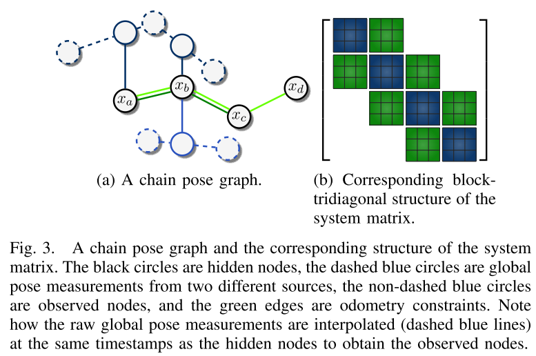

'''''

[[basic-information]]
Basic Information
-----------------

[[authors]]
Authors
~~~~~~~

* *Christian Merfels* is with Volkswagen Group Research, Wolfsburg, and Institute of Geodesy and Geoinformation, University of Bonn, Germany.
* *Cyrill Stachniss* is with Institute of Geodesy and Geoinformation, University of Bonn, Germany.

[[conference]]
Conference
~~~~~~~~~~

2016 IEEE/RSJ International Conference on Intelligent Robots and Systems (IROS)

[[abstract]]
Abstract
~~~~~~~~

* Combining multiple localization systems in a **plug and play manner**.
* Formulate this approach as a **sliding window pose graph**.
* The pose fusion approach scales from a filtering-based to a batch solution by increasing the size of the sliding window.
* The experiment runs at 20Hz on both simulated and real data.

[[keywords]]
Keywords
~~~~~~~~

'''''

[[introduction]]
Introduction
------------

[[problem-solution]]
Problem & Solution
~~~~~~~~~~~~~~~~~~

Individual localization system is not enough, and the combination of orthogonal localization systems is more powerful.

[[objective]]
Objective
~~~~~~~~~

This paper provides an approach to multi-sensor data fusion decouples the localization from the fusion task, which eneables the ability to incorporate third-party localization modules for which source code is unavailable.

[[formulation]]
Formulation
~~~~~~~~~~~

A coarse localization (red triangles), a precise but only temporary available localization (blue triangles), and odometry as dead reckoning trajectory (blue) are used to estimate the true trajectory (red) of a vehicle. The estimated poses are shown as black triangles: the goal is to approximate the unknown red line as closely as possible with the black triangles.

image:./img/posefusion.png[image,scaledwidth=80.0%]

[[contributions]]
Contributions
~~~~~~~~~~~~~

* efficient sensor fusion of generic odometry and global pose inputs latexmath:[$\Rightarrow$] an intuitive architecture for pose estimation and timing issues.
* graph construction algorithm latexmath:[$\Rightarrow$] a sparse block-tridiagonal structure of the system matrix latexmath:[$\Rightarrow$] fast solution

'''''

[[related-work]]
Related Work
------------

[[multi-sensor-data-fusion-for-navigation-systems]]
Multi-sensor data fusion for navigation systems
~~~~~~~~~~~~~~~~~~~~~~~~~~~~~~~~~~~~~~~~~~~~~~~

* **filtering-based approaches**: Kalman filter and its variants
** feature: rely at a very early stage on the Markov assumption and marginalize all older information
** problem: prematurely incorporating the linearization error.
* **sliding window smoothing algorithms**: compute the maximum likelihood (ML) estimate by nonlinear least squares optimization to a Bayesian network, Markov random field (MRF), or factor graph.
** feature: consider all past measurements up to the current one; and also consider future measurements for offline batch optimization.
** solution: online batch optimization becomes feasible through the usage of incremental smoothing techniques, such as iSAM2footnote:[M. Kaess, H. Johannsson, R. Roberts, V. Ila, J. Leonard, and F. Del- laert, ``iSAM2: Incremental Smoothing and Mapping using the Bayes tree,'' Int. Journal of Robotics Research, pp. 216–235, 2012.], that recalculate only the part of the graph that is affected by new measurements.
** Some implementations keep the size of the graph bounded by simply discarding older nodes and edges, thus potentially obtaining overconfident estimates.

[[methodical-origin]]
Methodical origin
~~~~~~~~~~~~~~~~~

* Sibley et al.footnote:[G. Sibley, L. Matthies, and G. Sukhatme, ``SlidingWindow Filter with Application to Planetary Landing,'' Journal of Field Robotics, vol. 27, no. 5, pp. 587–608, 2010], who are the first to introduce the concept of a slibing window filter in the context of robotics.
* Differences:
** apply this to the use case of pose fusion
** special design for a faster way of solving the nonlinear least squares equations, performing marginalization, and estimating the uncertainty of the output.
** provide a way of semantically reasoning about the prior information arising from marginalization by deriving a prior node.

[[pose-graph-fusion]]
Pose Graph Fusion
-----------------

[[nonlinear-least-squares-problem]]
Nonlinear least squares problem
~~~~~~~~~~~~~~~~~~~~~~~~~~~~~~~

This paper exploits the state-of-the-art graph optimization framework g2ofootnote:[R. K¨ ummerle, G. Grisetti, H. Strasdat, K. Konolige, and W. Burgard, ``g2o: A General Framework for Graph Optimization,'' in Proc. IEEE Int. Conf. Robotics and Automation (ICRA), 2011, pp. 3607–3613.].

The key idea is that given the state vector latexmath:[$x=(x_1^T, ..., x_m^T)^T$] and a set of measurements, where latexmath:[$z_{ij}$] is the mean and latexmath:[$\Omega_{ij}$] is the information matrix of a single measurement relating latexmath:[$x_i$] to latexmath:[$x_j$], least squares estimation seeks the state latexmath:[\[x^*=\arg\min_x{\sum_{i,j}e_{ij}^T\Omega_{ij}e_{ij}}~~~~(1)\]] that best explains all measurements given the latexmath:[$\mathcal{l}_2$] norm. The vector error function latexmath:[$e_{ij}=e(x_i,x_j,z_{ij})$] measures how well the constraint from the measurement latexmath:[$z_{ij}$] is satisfied. Solving (1) requires iteratively solving a linear system with the system matrix latexmath:[$H$] and the right-hand side vector latexmath:[$b$] such that latexmath:[\[H=\sum_{i,j}{J_{ij}(x)^T\Omega_{ij}J_{ij}(x)}\]] latexmath:[\[b^T=\sum_{i,j}e_{ij}^T\Omega_{ij}J_{ij}(x)\]] where latexmath:[$J_{ij}(x)$] refers to the Jacobian of the error function computed in state latexmath:[$x$].

[[sliding-window-chain-pose-graph-fusion]]
Sliding window chain pose graph fusion
~~~~~~~~~~~~~~~~~~~~~~~~~~~~~~~~~~~~~~

[[about-the-online-state-estimation-system]]
About the online state estimation system
^^^^^^^^^^^^^^^^^^^^^^^^^^^^^^^^^^^^^^^^

* general nonlinear least squares estimation taks into account all available information within the full pose graph
* to keep the problem computationally tractable, it is necessary to limit the considered information.
* this approach achieves this by marginalizing out prior state state variables and the state vector latexmath:[$x$] in a sliding window pose graph is reduced to the M most recent states latexmath:[$x=(x_{t-M+1}^T,...,x_t^T)^T$].

[[about-the-graph-structure]]
About the graph structure
^^^^^^^^^^^^^^^^^^^^^^^^^

* global pose source: measure poses within a global coordinate system, e.g. Universal Transverse Mercator (UTM) coordinate
* local pose source: measure spatial transformations relative to the previous pose, e.g. odometry
* hidden nodes (from MRFs): state variables
* observed nodes (from MRFs): global pose constraints, connected to hidden nodes to constrain them in the global coordinate frame.
* edge between hidden nodes: local pose constraints.
* The resulting form or the graph is called **chain pose graph**.

[[about-the-algorithm-working-frequency]]
About the algorithm working frequency
^^^^^^^^^^^^^^^^^^^^^^^^^^^^^^^^^^^^^

* Related graph-based approaches.
** generate a hidden node (state variables) every time a measurement arrives
** or tie their generation to a specific pose source
* This approach constructs a hidden node every time stamp.
** it queries all global pose sources for measurements and interpolate one observed node per source at the timestamp of the hidden node if measurements are available.
** it queries each local pose source to interpolate the edges between all two successive hidden nodes.
** enforce a certain matrix structure for H, to include all measurement sources in a generic way independetly of their specific output frequencies, and to a priori relate the number of state variables to the length of the interval of the sliding window.

[[about-the-system-matrix]]
About the system matrix
^^^^^^^^^^^^^^^^^^^^^^^

* The block-tridiagonal
